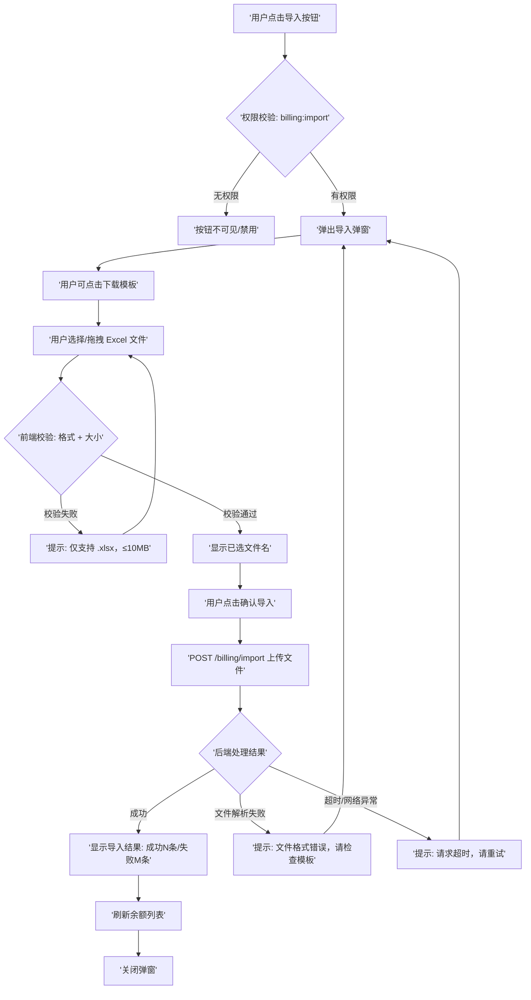
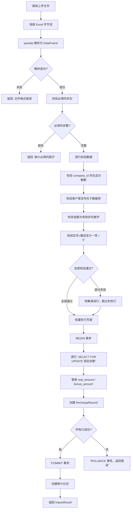
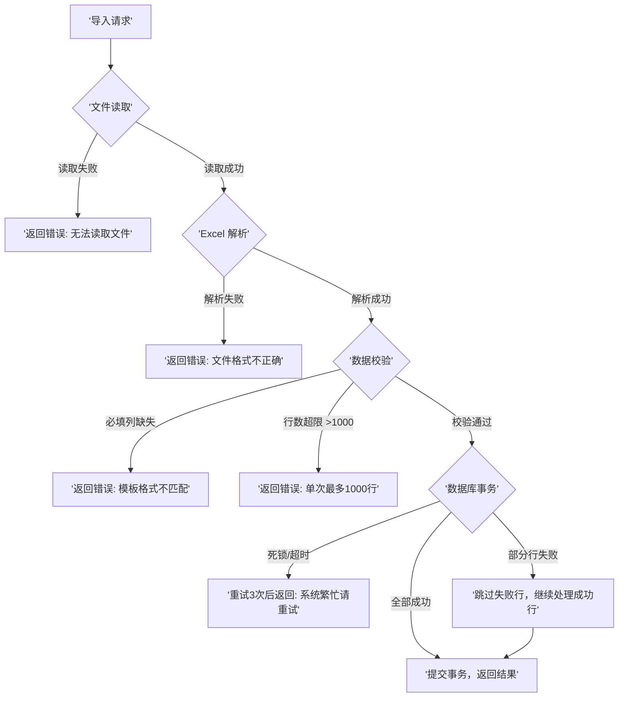

# 余额管理页面导入功能 PRD

## Metadata

| 字段 | 值 |
|------|-----|
| 作者 | AI Product Manager |
| 状态 | 草稿 |
| 创建日期 | 2026-06-14 |
| 更新日期 | 2026-06-14 |
| 版本 | v1.0 |
| 项目 | 客户运营中台 |
| 关联文档 | 客户管理导入功能（`backend/app/routes/customers.py`）、余额管理页面（`frontend/src/views/billing/Balance.vue`） |
| 原型 | 无 |

## 变更记录

| 版本 | 日期 | 变更内容 | 作者 |
|------|------|----------|------|
| v1.0 | 2026-06-14 | 初始版本：余额管理导入功能完整 PRD | AI Product Manager |

---

## 1. 问题描述

### 核心问题

余额管理页面当前仅支持**单笔充值**操作（`POST /billing/recharge`），运营/财务人员需要逐个客户手动录入充值金额。当需要批量为多个客户充值（如月初集中充值、活动赠送金额批量发放、客户迁移后余额初始化）时，操作效率极低且容易出错。

### 具体问题

1. **效率瓶颈**：每次充值需单独打开弹窗、搜索客户、填写金额、确认提交，单次操作约 30-60 秒。批量充值 100 个客户需 50-100 分钟
2. **易出错**：手动逐个操作容易遗漏客户、输错金额、混淆实充/赠送金额
3. **无批量审计**：每笔充值独立记录，缺乏批量操作的统一审计视图，难以追溯某次批量充值的全貌
4. **与行业实践脱节**：客户管理模块已支持 Excel 批量导入（`POST /customers/import`），余额管理缺少对等能力，用户体验不一致

### 影响范围

- **直接影响**：运营人员、财务人员日常充值操作效率
- **间接影响**：客户数据完整性（批量初始化场景）、财务对账效率
- **涉及系统**：余额管理页面（前端）、计费服务（后端）、审计日志系统

---

## 2. 目标定义

### 核心目标

为余额管理页面增加 **Excel 批量充值导入**功能，支持通过上传 Excel 文件一次性为多个客户批量充值（实充金额 + 赠送金额），复用现有客户导入的基础设施模式（文件上传 → 解析 → 校验 → 批量处理 → 结果反馈）。

### 成功指标

| # | 指标 | 目标值 | 计算方式 |
|---|------|--------|----------|
| M1 | 批量充值效率提升 | 100 个客户充值从 ~75 分钟降至 ≤5 分钟 | 对比手动逐笔 vs 导入操作耗时 |
| M2 | 导入成功率 | ≥ 95%（首次导入无格式错误） | 成功行数 / 总行数 × 100% |
| M3 | 数据准确率 | 100%（金额零误差） | 导入后余额与 Excel 数据逐行比对 |
| M4 | 功能采纳率 | 上线 30 天内 ≥ 60% 的充值操作通过导入完成 | 导入充值笔数 / 总充值笔数 × 100% |

---

## 3. 目标用户

| 用户角色 | 描述 | 使用频率 | 核心诉求 |
|----------|------|----------|----------|
| 运营人员 | 负责客户日常运营，需定期为客户充值赠送金额、活动奖励 | 高频（每周 1-3 次） | 快速批量操作，减少重复劳动 |
| 财务人员 | 负责客户账务管理，需批量初始化余额、调整充值金额 | 中频（月初/季度末集中操作） | 数据准确，有审计记录可追溯 |
| 系统管理员 | 负责系统数据迁移、初始化 | 低频（系统上线/迁移时） | 大批量数据导入，错误可回滚 |

### 使用场景

- **场景 A**：月初运营人员需为 200 个客户发放赠送金额，通过 Excel 一次性导入
- **场景 B**：财务人员在系统迁移后，需批量初始化 500 个客户的余额数据
- **场景 C**：运营人员下载导入模板，填写充值数据后上传，查看导入结果并处理失败行

---

## 4. 用户故事

### US-1：下载余额导入模板

**作为**运营人员，**我希望**能下载标准的余额导入 Excel 模板，**以便**按照正确格式准备充值数据。

**验收标准**：
- [ ] 余额管理页面提供「下载导入模板」按钮
- [ ] 下载的 Excel 文件包含必填列：客户编号（company_id）、实充金额（real_amount）、赠送金额（bonus_amount）
- [ ] 模板包含可选列：备注（remark）
- [ ] 模板包含示例数据行和字段说明行，帮助用户理解格式要求
- [ ] 模板文件大小 ≤ 50KB，下载时间 ≤ 3 秒

### US-2：上传 Excel 批量充值

**作为**运营人员，**我希望**能通过上传 Excel 文件批量为客户充值，**以便**一次性完成多个客户的充值操作。

**验收标准**：
- [ ] 余额管理页面提供「导入」按钮，需具备 `billing:import` 权限
- [ ] 支持 .xlsx 格式文件，文件大小限制 ≤ 10MB
- [ ] 上传弹窗包含文件选择区域（支持点击和拖拽上传）
- [ ] 前端校验文件格式和扩展名，不符合时即时提示
- [ ] 单次导入上限 1000 行，超出时提示用户分批操作

### US-3：查看导入结果

**作为**运营人员，**我希望**在导入完成后能看到详细的导入结果，**以便**了解成功/失败情况并处理异常数据。

**验收标准**：
- [ ] 导入完成后显示结果摘要：成功数量、失败数量
- [ ] 失败记录展示具体失败原因（如：客户编号不存在、金额格式错误、金额为负数等）
- [ ] 导入成功后自动刷新余额列表数据
- [ ] 导入结果支持关闭，关闭后不影响已导入数据

### US-4：导入操作审计追溯

**作为**财务人员，**我希望**每次批量导入都有完整的审计记录，**以便**后续追溯和对账。

**验收标准**：
- [ ] 每次导入操作生成审计日志，记录操作人、时间、成功/失败数量
- [ ] 每笔成功充值生成独立的 RechargeRecord 记录，operator 标记为导入操作人
- [ ] 审计日志可通过系统审计页面查询

---

## 5. 功能交互流程图

### 5.1 余额导入主流程



### 5.2 后端数据处理流程



### 5.3 异常处理流程



---

## 6. 详细功能清单

| 编号 | 功能名称 | 优先级 | 目标平台 | 关联用户故事 |
|------|----------|--------|----------|--------------|
| F-1.1 | 下载余额导入模板 | P0 | Web | US-1 |
| F-1.2 | 导入按钮与权限控制 | P0 | Web | US-2 |
| F-1.3 | 导入弹窗 UI | P0 | Web | US-2 |
| F-1.4 | 文件上传与前端校验 | P0 | Web | US-2 |
| F-1.5 | 后端 Excel 解析与数据校验 | P0 | Web | US-2, US-3 |
| F-1.6 | 批量充值事务执行 | P0 | Web | US-2, US-3, US-4 |
| F-1.7 | 导入结果展示 | P0 | Web | US-3 |
| F-1.8 | 审计日志记录 | P1 | Web | US-4 |

---

## 7. 各详细功能说明

### F-1.1 下载余额导入模板

**功能描述**：在余额管理页面的导入弹窗中提供「下载导入模板」按钮，用户可下载标准 Excel 模板文件，包含必填列、可选列、示例数据和字段说明。

**触发时机**：用户点击导入弹窗中的「下载导入模板」链接/按钮。

**交互说明**：
- 点击后触发浏览器下载，文件名：`余额导入模板.xlsx`
- 下载过程无阻塞，不关闭弹窗
- 下载完成后无额外提示（浏览器默认下载行为）

**场景行为**：
- 模板包含以下列：
  | 列名 | 字段标识 | 是否必填 | 数据类型 | 说明 |
  |------|----------|----------|----------|------|
  | 客户编号 | company_id | 是 | 整数 | 客户唯一标识，必须存在于系统中 |
  | 实充金额 | real_amount | 是 | 数字（≥0） | 实际充值金额，精确到分 |
  | 赠送金额 | bonus_amount | 是 | 数字（≥0） | 赠送金额，精确到分 |
  | 备注 | remark | 否 | 文本 | 充值备注，最长 200 字符 |
- 第 1 行：列标题
- 第 2 行：字段说明（灰色字体）
- 第 3 行：示例数据
- 模板文件大小 ≤ 50KB

**验收标准**：
- [ ] 点击「下载导入模板」后浏览器下载 `余额导入模板.xlsx`
- [ ] 模板包含 4 列：客户编号、实充金额、赠送金额、备注
- [ ] 模板第 2 行为字段说明，第 3 行为示例数据
- [ ] 模板文件大小 ≤ 50KB

**边界/异常处理**：
- 网络异常：下载失败时浏览器提示下载错误，弹窗保持打开
- 模板接口 500：前端提示「模板下载失败，请稍后重试」

---

### F-1.2 导入按钮与权限控制

**功能描述**：在余额管理页面工具栏添加「导入」按钮，仅对拥有 `billing:import` 权限的用户可见。

**触发时机**：用户进入余额管理页面。

**交互说明**：
- 按钮位于页面工具栏，与「新建充值」按钮并列
- 按钮图标使用 Arco Design 的 `icon-upload` 图标
- 无权限用户不渲染该按钮（非禁用，而是完全不显示）

**场景行为**：
- 有 `billing:import` 权限：显示「导入」按钮
- 无权限：按钮不渲染，用户无法感知该功能存在

**验收标准**：
- [ ] 拥有 `billing:import` 权限的用户可见「导入」按钮
- [ ] 无权限用户页面中不渲染该按钮
- [ ] 按钮点击后弹出导入弹窗

**边界/异常处理**：
- 权限变更（管理员实时撤销）：用户刷新页面后按钮消失，不影响已打开的弹窗（弹窗提交时后端会二次校验权限）

---

### F-1.3 导入弹窗 UI

**功能描述**：导入弹窗提供模板下载入口、文件上传区域、导入提示说明，引导用户完成导入操作。

**触发时机**：用户点击「导入」按钮。

**交互说明**：
- 弹窗标题：「批量充值导入」
- 弹窗宽度：520px
- 弹窗内容分区：
  1. **顶部提示区**：黄色 Alert 提示「请先下载模板，按格式填写后上传」+ 「下载导入模板」链接
  2. **文件上传区**：拖拽上传区域，支持点击选择文件
     - 未选文件：显示云上传图标 + 「点击或拖拽文件到此处」
     - 已选文件：显示文件名 + 文件大小 + 「重新选择」链接
  3. **导入说明区**：灰色文字列表
     - 仅支持 .xlsx 格式文件
     - 单次最多导入 1000 条记录
     - 客户编号必须存在于系统中
     - 实充金额和赠送金额不能同时为 0
- 弹窗底部按钮：「取消」「确认导入」

**场景行为**：
- 用户打开弹窗 → 看到模板下载提示和上传区域
- 用户可先下载模板，填写后回来上传
- 用户选择文件后，「确认导入」按钮变为可点击状态

**验收标准**：
- [ ] 弹窗包含模板下载链接、文件上传区、导入说明
- [ ] 未选文件时「确认导入」按钮禁用
- [ ] 已选文件时显示文件名和文件大小
- [ ] 点击「取消」或关闭图标关闭弹窗，清空已选文件

**边界/异常处理**：
- 弹窗打开时网络断开：不影响弹窗展示，提交时捕获网络错误

---

### F-1.4 文件上传与前端校验

**功能描述**：用户选择文件后，前端校验文件格式和大小，校验通过后允许提交。

**触发时机**：用户选择文件或拖拽文件到上传区域。

**交互说明**：
- 文件选择方式：点击上传区域弹出文件选择器，或拖拽文件到上传区域
- 文件选择器限制：`accept=".xlsx,.xls"`
- 前端校验规则：
  1. 文件扩展名：必须为 `.xlsx` 或 `.xls`
  2. MIME 类型：`application/vnd.openxmlformats-officedocument.spreadsheetml.sheet` 或 `application/vnd.ms-excel`
  3. 文件大小：≤ 10MB
- 校验失败：上传区域下方显示红色错误提示，文件不被接受，保持未选状态
- 校验通过：显示文件名和大小，「确认导入」按钮启用

**场景行为**：
- 用户选择 `.csv` 文件 → 提示「仅支持 .xlsx 格式」
- 用户选择 15MB 文件 → 提示「文件大小不能超过 10MB」
- 用户选择合法 `.xlsx` 文件 → 显示文件名，按钮启用

**验收标准**：
- [ ] 选择非 .xlsx/.xls 文件时提示格式错误
- [ ] 选择 >10MB 文件时提示大小超限
- [ ] 选择合法文件后显示文件名和大小
- [ ] 支持拖拽上传
- [ ] 点击「重新选择」可重新选择文件

**边界/异常处理**：
- 用户选择文件后删除本地文件：提交时捕获读取错误，提示「文件读取失败」
- 用户快速连续选择多个文件：以最后一次选择为准

---

### F-1.5 后端 Excel 解析与数据校验

**功能描述**：后端接收上传文件，使用 pandas 解析 Excel，逐行校验数据合法性，收集错误行。

**触发时机**：前端提交 `POST /api/v1/billing/import` 请求。

**交互说明**：
- 接口路径：`POST /api/v1/billing/import`
- 请求格式：`multipart/form-data`，字段名 `file`
- 权限要求：`billing:import`
- 响应格式：`{ code: 0, data: { success_count, error_count, errors: string[] } }`

**场景行为**：
- 后端读取文件字节流，使用 `pd.read_excel(engine='openpyxl')` 解析
- 校验流程：
  1. 解析成功？失败 → 返回「文件格式错误」
  2. 必填列存在？缺失 → 返回「缺少必填列：xxx」
  3. 行数 ≤ 1000？超出 → 返回「单次最多导入 1000 条」
  4. 逐行校验：
     - `company_id` 存在且为整数 → 失败记录「第 N 行：客户编号无效」
     - 客户存在于数据库 → 失败记录「第 N 行：客户编号 xxx 不存在」
     - `real_amount` 为数字且 ≥ 0 → 失败记录「第 N 行：实充金额格式错误」
     - `bonus_amount` 为数字且 ≥ 0 → 失败记录「第 N 行：赠送金额格式错误」
     - `real_amount + bonus_amount > 0` → 失败记录「第 N 行：充值金额不能同时为 0」
     - `remark` 长度 ≤ 200 → 超长截断，不报错
- 校验通过的行进入批量执行阶段

**验收标准**：
- [ ] 上传非 Excel 文件返回「文件格式错误」
- [ ] 缺少必填列返回具体缺失列名
- [ ] 行数 >1000 返回「单次最多导入 1000 条」
- [ ] 客户编号不存在返回具体行号和编号
- [ ] 金额为负数或非数字返回具体行号和错误
- [ ] 实充 + 赠送同时为 0 返回错误
- [ ] 部分行失败时，成功行继续处理，返回成功/失败数量及错误详情

**边界/异常处理**：
- 文件为空（0 行数据）：返回「文件中无有效数据」
- Excel 包含隐藏行/列：pandas 默认读取可见内容，忽略隐藏行
- 单元格包含公式：读取公式结果值，非公式本身
- 单元格包含特殊字符（#N/A, #VALUE!）：清洗为空值，按缺失处理

---

### F-1.6 批量充值事务执行

**功能描述**：对校验通过的行，在数据库事务中逐行执行充值操作，更新余额并创建充值记录。

**触发时机**：数据校验通过后自动执行。

**交互说明**：
- 事务隔离级别：READ COMMITTED
- 每行充值操作：
  1. `SELECT ... FOR UPDATE` 锁定 `CustomerBalance` 行
  2. 更新 `real_amount += row.real_amount`
  3. 更新 `bonus_amount += row.bonus_amount`
  4. 更新 `total_amount = real_amount + bonus_amount`
  5. 创建 `RechargeRecord`：`customer_id, real_amount, bonus_amount, operator=current_user, remark=row.remark, proof='批量导入'`
- 死锁重试：最多 3 次，间隔 100ms
- 全部成功 → COMMIT；任一行失败 → 该行跳过，不影响其他行（非整批回滚）

**场景行为**：
- 100 行数据，98 行校验通过 → 98 行全部在事务中执行
- 执行中第 50 行死锁 → 重试 3 次，成功则继续，仍失败则跳过该行并记录错误
- 全部执行完成 → 返回 `{ success_count: 97, error_count: 1, errors: [...] }`

**验收标准**：
- [ ] 充值成功后 `CustomerBalance.real_amount` 和 `bonus_amount` 正确累加
- [ ] 每笔成功充值生成 `RechargeRecord` 记录
- [ ] 充值记录 `proof` 字段值为「批量导入」
- [ ] 死锁场景自动重试 3 次
- [ ] 部分行失败不影响其他行提交
- [ ] 事务完成后余额列表可即时查询到最新数据

**边界/异常处理**：
- 充值过程中客户被删除：`FOR UPDATE` 返回空，记录错误「客户已被删除」，跳过
- 数据库连接超时：事务回滚，返回「系统繁忙，请稍后重试」
- 并发导入同一客户：行级锁保证串行化，不出现金额覆盖

---

### F-1.7 导入结果展示

**功能描述**：导入完成后，前端展示导入结果摘要和错误详情，刷新余额列表。

**触发时机**：后端返回导入结果后。

**交互说明**：
- 弹窗内容切换为结果展示视图：
  - 全部成功：绿色成功提示「导入成功，共充值 N 条记录」
  - 部分失败：橙色警告提示「导入完成，成功 N 条，失败 M 条」+ 错误列表
  - 全部失败：红色错误提示「导入失败」+ 错误列表
- 错误列表：可滚动区域，每条错误一行，格式「第 X 行：错误原因」
- 底部按钮：「关闭」
- 点击「关闭」：关闭弹窗，刷新余额列表数据

**场景行为**：
- 导入 100 条，全部成功 → 绿色提示 + 「关闭」按钮
- 导入 100 条，3 条失败 → 橙色提示 + 3 行错误详情 + 「关闭」按钮
- 用户点击「关闭」→ 弹窗关闭，页面自动刷新余额列表

**验收标准**：
- [ ] 全部成功时显示绿色成功提示和成功数量
- [ ] 部分失败时显示橙色警告和错误列表
- [ ] 错误列表显示具体行号和错误原因
- [ ] 点击「关闭」后弹窗关闭且余额列表刷新
- [ ] 导入结果可滚动查看（错误条数 > 10 时）

**边界/异常处理**：
- 错误列表超长（>100 条）：限制显示前 100 条，提示「更多错误请查看日志」
- 网络超时（>30s）：前端提示「请求超时，请稍后查看导入结果」，不阻塞页面

---

### F-1.8 审计日志记录

**功能描述**：每次导入操作生成审计日志，记录操作人、时间、成功/失败数量，便于追溯。

**触发时机**：导入事务提交后。

**交互说明**：
- 审计日志字段：
  - `action`: `balance_import`
  - `operator`: 当前用户 ID
  - `timestamp`: 操作时间
  - `details`: `{ total_rows, success_count, error_count, filename }`
- 审计日志写入 `AuditLog` 表
- 每笔成功充值同时写入 `RechargeRecord`，`operator` 为当前用户

**场景行为**：
- 运营 A 导入 100 条，成功 98 条 → 审计日志记录：`{ total_rows: 100, success_count: 98, error_count: 2, filename: '充值数据.xlsx' }`
- 审计页面可查询该记录，筛选条件：`action=balance_import`

**验收标准**：
- [ ] 每次导入生成一条审计日志
- [ ] 审计日志包含操作人、时间、成功/失败数量、文件名
- [ ] 每笔成功充值生成独立的 `RechargeRecord`
- [ ] 审计日志可通过审计页面查询

**边界/异常处理**：
- 审计日志写入失败：不影响充值事务（审计日志异步写入或降级为日志文件）
- 审计日志数据丢失：`RechargeRecord` 作为兜底，可通过充值记录反推导入操作

---

## 8. 埋点设计

### 埋点功能清单

| 埋点事件 | 触发时机 | 关联成功指标 | 数据用途 |
|----------|----------|--------------|----------|
| `balance_import_modal_open` | 用户点击「导入」按钮，弹窗打开 | M4 功能采纳率 | 统计功能使用频次 |
| `balance_import_template_download` | 用户点击「下载导入模板」 | M4 功能采纳率 | 统计模板下载率 |
| `balance_import_submit` | 用户点击「确认导入」，提交文件 | M4 功能采纳率 | 统计导入提交次数 |
| `balance_import_result` | 后端返回导入结果 | M2 导入成功率, M4 功能采纳率 | 统计成功/失败分布 |
| `balance_import_error` | 导入失败（校验失败或系统错误） | M2 导入成功率 | 分析失败原因分布 |

### 埋点说明

#### balance_import_modal_open
```json
{
  "event": "balance_import_modal_open",
  "timestamp": "2026-06-14T10:00:00Z",
  "user_id": 123,
  "user_role": "operator",
  "page": "balance_management"
}
```

#### balance_import_template_download
```json
{
  "event": "balance_import_template_download",
  "timestamp": "2026-06-14T10:01:00Z",
  "user_id": 123,
  "template_type": "balance_import"
}
```

#### balance_import_submit
```json
{
  "event": "balance_import_submit",
  "timestamp": "2026-06-14T10:02:00Z",
  "user_id": 123,
  "file_size_kb": 45,
  "estimated_rows": 100
}
```

#### balance_import_result
```json
{
  "event": "balance_import_result",
  "timestamp": "2026-06-14T10:02:05Z",
  "user_id": 123,
  "success_count": 98,
  "error_count": 2,
  "total_rows": 100,
  "success_rate": 0.98,
  "processing_time_ms": 5000
}
```

#### balance_import_error
```json
{
  "event": "balance_import_error",
  "timestamp": "2026-06-14T10:02:05Z",
  "user_id": 123,
  "error_type": "validation_failed",
  "error_count": 2,
  "error_details": [
    "第 15 行：客户编号 9999 不存在",
    "第 42 行：实充金额为负数"
  ]
}
```

### 成功指标计算方式

#### M1 批量充值效率提升
```
计算公式：对比手动逐笔充值 100 个客户的耗时 vs 导入 100 个客户的耗时
数据来源：
  - 手动耗时：基于历史操作日志，计算平均每笔充值耗时 × 100
  - 导入耗时：从 balance_import_submit 到 balance_import_result 的时间差（processing_time_ms）
目标值：导入耗时 ≤ 5 分钟（300,000 ms）
```

#### M2 导入成功率
```
计算公式：success_count / total_rows × 100%
数据来源：balance_import_result 埋点
目标值：≥ 95%
统计周期：上线后 30 天滚动计算
```

#### M3 数据准确率
```
计算公式：导入后余额与 Excel 数据逐行比对的准确率
数据来源：
  - 导入前：记录 Excel 中每行的 real_amount 和 bonus_amount
  - 导入后：查询 CustomerBalance 表，比对增量是否一致
  - 自动化测试脚本定期抽样校验
目标值：100%
```

#### M4 功能采纳率
```
计算公式：导入充值笔数 / 总充值笔数 × 100%
数据来源：
  - 导入充值笔数：RechargeRecord 表中 proof='批量导入' 的记录数
  - 总充值笔数：RechargeRecord 表全部记录数
目标值：上线 30 天内 ≥ 60%
```

---

## 9. 未来改进计划

| 编号 | 功能名称 | 优先级 | 目标平台 | 说明 |
|------|----------|--------|----------|------|
| F-2.1 | 导入结果导出 | P2 | Web | 支持导出导入结果（成功/失败明细）为 Excel，便于存档和对账 |
| F-2.2 | 导入历史记录 | P2 | Web | 页面展示历史导入记录（时间、操作人、成功/失败数），支持查看详情 |
| F-2.3 | 预校验模式 | P2 | Web | 上传后先预校验（不提交），展示校验结果，用户确认后再正式导入 |
| F-2.4 | 模板智能识别 | P2 | Web | 支持用户上传非标准模板，系统自动映射列名到标准字段 |
| F-2.5 | 异步导入 | P2 | Web | 超大数据量（>1000 行）支持异步导入，完成后通知用户 |
| F-2.6 | 导入审批流 | P2 | Web | 大额批量充值需上级审批，审批通过后自动执行 |

---

## 10. 风险与依赖

### 技术风险

| 风险项 | 影响 | 概率 | 缓解措施 |
|--------|------|------|----------|
| 大数据量导入导致数据库锁竞争 | 高并发时可能出现死锁或超时 | 中 | 使用行级锁（FOR UPDATE）+ 死锁重试机制（3 次）；限制单次导入上限 1000 行 |
| Excel 文件格式异常（损坏、加密） | pandas 解析失败 | 中 | 前端校验文件扩展名和 MIME 类型；后端捕获解析异常，返回友好错误提示 |
| 内存溢出（超大文件） | 服务崩溃 | 低 | 限制文件大小 ≤ 10MB；限制行数 ≤ 1000；pandas 流式读取 |
| 并发导入同一客户 | 数据不一致 | 低 | 行级锁保证串行化；事务隔离级别 READ COMMITTED |

### 外部依赖

| 依赖项 | 状态 | 说明 |
|--------|------|------|
| 客户管理模块（company_id 校验） | completed | 导入时需校验客户编号是否存在于 customers 表 |
| 余额管理服务（CustomerBalance） | completed | 充值操作依赖余额表存在 |
| 审计日志服务（AuditLog） | completed | 导入操作需写入审计日志 |
| 权限系统（billing:import） | confirmed | 需在权限系统中新增 `billing:import` 权限点 |
| 文件上传基础设施 | completed | 复用现有文件上传中间件（MIME 校验、大小限制） |

### 已知限制

| 限制项 | 说明 | 影响 | 解决方案 |
|--------|------|------|----------|
| 单次导入上限 1000 行 | 防止内存溢出和长事务 | 超大数据量需分批导入 | 未来支持异步导入（F-2.5） |
| 仅支持 .xlsx 格式 | 简化解析逻辑，避免兼容性问题 | 不支持 .csv、.xls（旧版 Excel） | 前端提示格式要求；未来可扩展 |
| 不支持更新已有余额 | 仅支持累加充值，不支持覆盖 | 无法修正历史错误数据 | 通过单笔充值调整；未来支持预校验模式（F-2.3） |
| 无导入撤销功能 | 事务提交后不可回滚 | 错误导入需手动调整 | 导入前仔细校验；未来支持导入历史记录（F-2.2） |

### 不可控因素

| 因素 | 影响 | 应对策略 |
|------|------|----------|
| 用户上传恶意文件 | 安全风险 | 文件类型白名单 + MIME 校验 + 文件大小限制；不执行文件内容 |
| 用户误操作（导入错误数据） | 数据污染 | 导入前弹窗确认；导入结果展示错误详情；未来支持导入审批（F-2.6） |
| 第三方 Excel 软件兼容性 | 解析失败 | 使用标准 openpyxl 引擎；测试主流 Excel 软件（Microsoft Excel、WPS、Google Sheets） |

---

## 11. 决策日志

| # | 决策 | 原因 | 替代方案 | 结论 |
---|------|------|----------|------|
| D1 | 仅支持 .xlsx 格式，不支持 .csv | 与客户管理导入保持一致（`POST /customers/import` 仅支持 .xlsx）；.xlsx 支持多 Sheet、数据类型保留 | 支持 .csv + .xlsx | 统一格式降低维护成本，用户已有 .xlsx 使用习惯 |
| D2 | 使用行级锁（FOR UPDATE）保证并发安全 | 现有 `BalanceService.consume()` 已使用相同模式，经过生产验证；防止并发充值导致金额覆盖 | 乐观锁（版本号） | 行级锁在充值场景更可靠，死锁重试机制已有先例 |
| D3 | 单次导入上限 1000 行 | 防止内存溢出和长事务阻塞；与客户导入限制一致 | 5000 行 / 无限制 | 1000 行覆盖 95% 场景，超大量可通过分批或未来异步导入解决 |
| D4 | 部分成功模式（非全部回滚） | 客户导入采用相同模式；用户不需要因少量错误行重新提交全部数据 | 全部成功才提交 | 部分成功提升用户体验，错误行可修正后单独重新导入 |
| D5 | 新增 `billing:import` 权限点 | 余额管理和客户管理属于不同权限域；财务操作需独立权限控制 | 复用 `customers:import` | 独立权限更精细，符合最小权限原则 |
| D6 | 每行生成独立 RechargeRecord | 与现有单笔充值记录结构一致；便于审计追溯和后续对账 | 批量记录合并为一条 | 独立记录粒度更细，支持逐条查询和审计 |
| D7 | 模板包含示例数据行和字段说明行 | 客户导入模板采用相同设计，用户已有使用经验 | 仅含列标题 | 降低用户学习成本，减少格式错误 |

---

## 12. 术语表

| 术语 | 定义 | 上下文 |
|------|------|--------|
| CustomerBalance | 客户余额表，存储每个客户的总余额、实充金额、赠送金额及已使用金额 | 数据模型：`backend/app/models/billing.py` |
| RechargeRecord | 充值记录表，记录每笔充值操作的金额、操作人、备注、凭证 | 数据模型：`backend/app/models/billing.py` |
| company_id | 客户编号，客户在系统中的唯一整数标识 | 客户管理模块核心字段 |
| real_amount | 实充金额，客户实际支付的充值金额 | CustomerBalance 和 RechargeRecord 字段 |
| bonus_amount | 赠送金额，系统赠送的充值金额 | CustomerBalance 和 RechargeRecord 字段 |
| FOR UPDATE | SQL 行级锁，防止并发修改同一行数据 | 余额操作并发控制 |
| pandas | Python 数据分析库，用于 Excel 文件解析 | 后端 Excel 处理依赖 |
| openpyxl | Python 库，pandas 读取 .xlsx 文件的引擎 | Excel 解析依赖 |
| ImportResult | 导入结果数据结构：`{ success_count, error_count, errors: string[] }` | 前后端导入结果通信格式 |
| billing:import | 余额导入权限标识 | RBAC 权限系统 |
| multipart/form-data | HTTP 请求格式，用于文件上传 | 文件上传标准协议 |
| READ COMMITTED | 数据库事务隔离级别，保证读取已提交数据 | 事务隔离策略 |

---

## 13. 假设索引

| # | 假设内容 | 来源章节 | 置信度 | 状态 | 验证方式 |
|---|----------|----------|--------|------|----------|
| A1 | 权限系统可新增 `billing:import` 权限点，无需修改现有权限架构 | Ch6 F-1.2, Ch10 | 高 | ✅ 已确认 | 用户确认 |
| A2 | 现有 `BalanceService.recharge()` 的行级锁 + 死锁重试机制可直接复用 | Ch7 F-1.6 | 高 | ✅ 已确认 | 用户确认 |
| A3 | 单次 1000 行导入在现有服务器配置下处理时间 ≤ 30 秒 | Ch7 F-1.5, Ch10 | 中 | ✅ 已确认 | 用户确认，上线前仍需压测验证 |
| A4 | 用户已有 Excel 导入经验（客户管理导入功能已上线），学习成本低 | Ch1, Ch9 | 高 | 待验证 | 客户导入功能已在使用中 |
| A5 | `RechargeRecord.proof` 字段可存储「批量导入」标识，用于区分导入充值和手动充值 | Ch7 F-1.6, Ch8 | 高 | 待验证 | 确认 proof 字段为文本类型，无长度限制冲突 |
| A6 | 审计日志写入失败不影响充值事务提交（异步写入或降级） | Ch7 F-1.8 | 中 | ✅ 已确认 | 用户确认 |
| A7 | 前端 Arco Design 组件库的拖拽上传组件满足需求，无需自定义实现 | Ch7 F-1.3, F-1.4 | 高 | 待验证 | 客户导入已使用相同组件，验证通过 |
